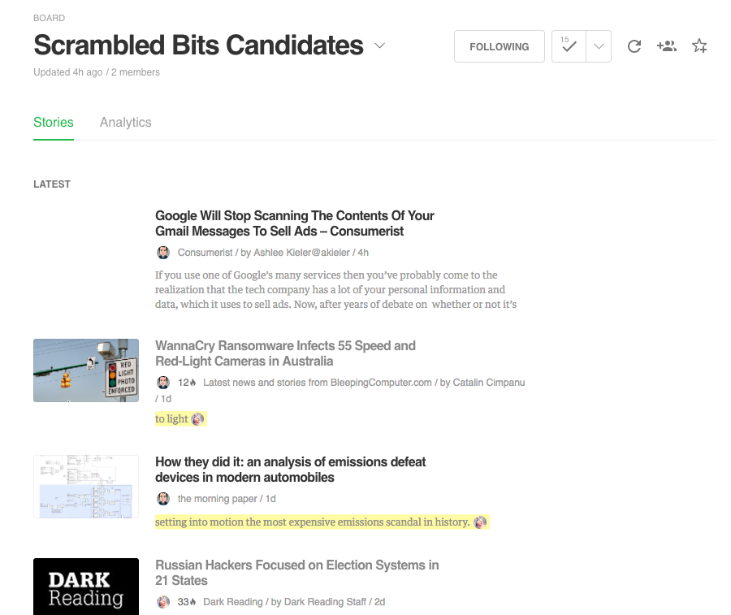
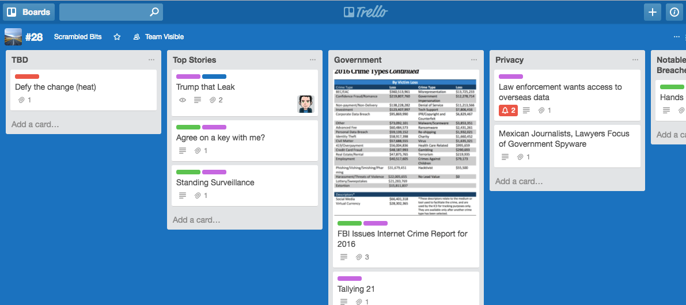
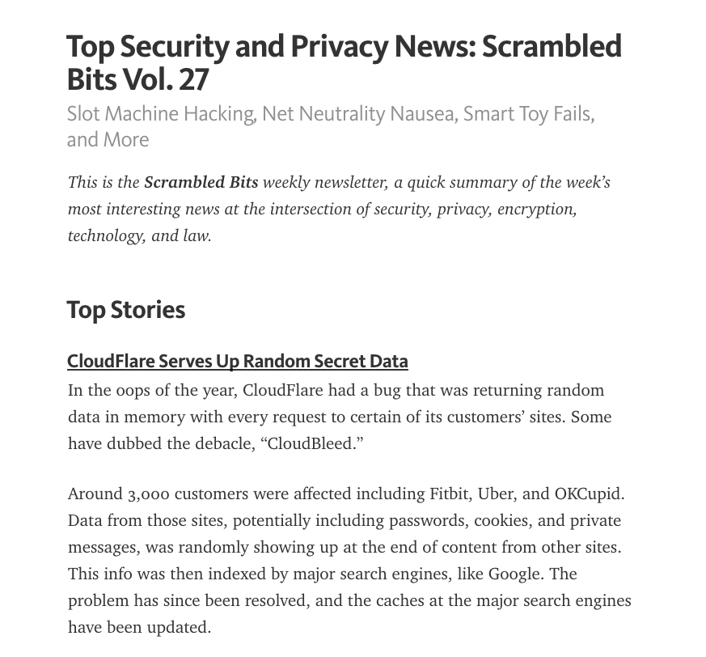

# README

# What this does

This script grabs a Trello board and turns it into a Markdown document suitable for publishing. Specifically, we use this to collaboratively assemble the [Scrambled Bits news summary](https://blog.ironcorelabs.com/tagged/news) of notable and interesting privacy and security news.

We blatantly stole this idea from [The Changelog Weekly](https://changelog.com/posts/trello-as-a-cms), who does something similar.  In our case, we have a few tweaks on the workflow and ultimately post data into Medium.  Our workflow also incorporates Feedly and Zapier in the notable news collection process.

This isn't terribly generic, but it also isn't far off and probably wouldn't need a lot to adapt.  The ability to have multiple people putting together, sorting, filtering and prepping stories and then to generate a Medium post is pretty handy.


# Requirements

* This requires Ruby 2.4 or above.

# Getting started

To make this all work, you need to create a `.credentials` file in the root directory of the repo.  This is a YAML file with three keys and values:

```yaml
developer_public_key: blahblah
member_token: blahblah
medium_token: blahblah
```

The first two lines are for trello.  To get the values that are needed to communicate with Trello, follow these steps (from the [trello gem](https://github.com/jeremytregunna/ruby-trello#configuration)):

```bash
% rvm use 2.4
% bundle install
% irb -rubygems
irb> require 'trello'
irb> Trello.open_public_key_url
irb> Trello.open_authorization_url key: 'your public key'
```

The public key goes to `developer_public_key` and the auth key goes to `member_token`.

Next, get your Medium integration token. Log into Medium, go to the `Settings` page, scrol down to `Integration tokens`, add a name and click `Get`.  Put that on the `medium_token` line.

Finally, test the integration.  `./trello2scrambledbits.rb help` will tell you your options.  You can specify a trello board based on the ID in the URL or based on the ID given to you if you specify nothing and then pick from the presented list.

# Workflow Screenshots




